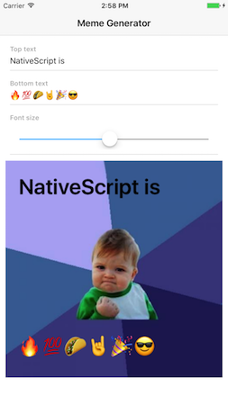
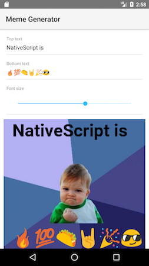

# NativeScript Meme Generator

A NativeScript plugin for generating bitmap images with custom text 😎




## Installation

```
tns plugin add nativescript-meme-generator
```

## Usage

Here’s a simple example on how you can get a meme up and running.

``` XML
<Page navigatingTo="onNavigatingTo" class="page"
  xmlns:meme="nativescript-meme-generator">

  <ActionBar title="Memes!"></ActionBar>

  <StackLayout>
    <meme:Meme
      topText="NativeScript is"
      bottomText="awesome"
      memeImageSource="{{ image }}"
      height="400" width="400"></meme:Meme>
  </StackLayout>
</Page>
```

``` TypeScript
import { EventData, Observable } from "data/observable";
import { Page } from "ui/page";
import { fromFileOrResource, ImageSource } from "image-source";

let pageData = new Observable();

export function onNavigatingTo(args: EventData) {
  let page = <Page>args.object;

  pageData.set("topText", "NativeScript is");
  pageData.set("bottomText", "🔥💯🌮🤘🎉😎");
  pageData.set("fontSize", 50);
  pageData.set("image", fromFileOrResource("~/images/0.png"));

  page.bindingContext = pageData;
}
```

## License

MIT. Go nuts!
